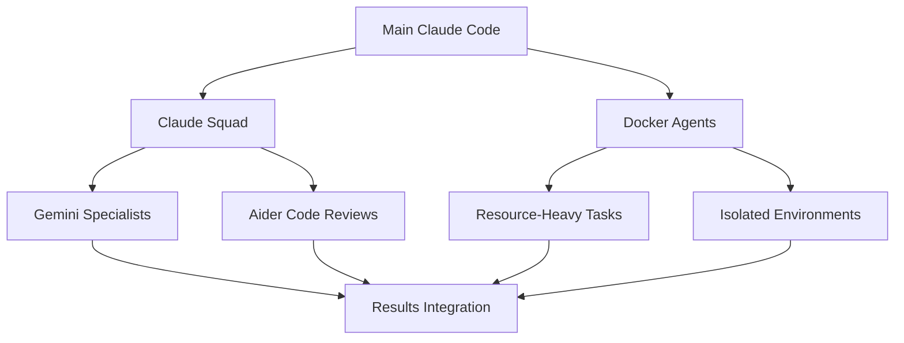

# External Multi-Agent Tools

Third-party tools and platforms for managing multiple AI agents simultaneously, providing interfaces and orchestration beyond Claude Code's built-in capabilities.

## Overview

While Claude Code provides sub-agent delegation through the Task tool, external multi-agent tools offer enhanced management interfaces, broader agent support, and advanced orchestration features for complex development workflows.

## Major Multi-Agent Platforms

### Claude Squad
**Description**: Terminal application for managing multiple AI agents including Claude Code, Codex, Gemini, and other local agents like Aider.

**Key Features**:
- Unified interface for multiple AI agent types
- Separate workspaces for different projects
- Support for both cloud and local AI agents
- Terminal-based workflow integration

**Use Cases**:
- Managing different AI agents for specialized tasks
- Project-based agent organization
- Cross-platform AI agent coordination

**Setup**:
```bash
# Installation varies by platform
# Check GitHub repository for latest instructions
git clone https://github.com/smtg-ai/claude-squad
cd claude-squad
# Follow installation instructions
```

### Async Code
**Description**: Visual interface for running Claude Code and other AI agents in parallel with a Codex-style UI for multi-task management.

**Key Features**:
- Multi-agent support for parallel operations
- Visual interface for managing multiple Claude instances
- Coordination between different AI coding tools
- Task-based workflow organization

**Use Cases**:
- Visual management of multiple development tasks
- Parallel feature development across different agents
- Coordinated multi-agent development workflows

**Setup**:
```bash
# Check GitHub for latest installation
# GitHub: ObservedObserver/async-code
npm install -g async-code
async-code --help
```

### Container-Based Solutions

#### Docker Agent Deployment
**Description**: Deploy AI agents in isolated containers with resource limits and scalability controls.

**Benefits**:
- Complete environment isolation
- Resource management (CPU/memory limits)
- Scalable through container orchestration
- Support for complex tech stacks

**Example Setup**:
```dockerfile
# Dockerfile for Claude Code agent
FROM node:18-alpine

WORKDIR /app
RUN npm install -g @anthropic/claude-code

# Set resource limits
ENV NODE_OPTIONS="--max-old-space-size=1024"

# Agent startup script
COPY start-agent.sh /app/
RUN chmod +x start-agent.sh

CMD ["./start-agent.sh"]
```

```bash
# Build and run multiple agent containers
docker build -t claude-agent .

# Spawn multiple agents with resource limits
docker run -d --name agent-1 --memory="1g" --cpus="0.5" claude-agent
docker run -d --name agent-2 --memory="1g" --cpus="0.5" claude-agent
docker run -d --name agent-3 --memory="1g" --cpus="0.5" claude-agent
```

#### Kubernetes Orchestration
**Description**: Large-scale agent deployment and management using Kubernetes.

**Configuration Example**:
```yaml
# claude-agent-deployment.yaml
apiVersion: apps/v1
kind: Deployment
metadata:
  name: claude-agents
spec:
  replicas: 5
  selector:
    matchLabels:
      app: claude-agent
  template:
    metadata:
      labels:
        app: claude-agent
    spec:
      containers:
      - name: claude-agent
        image: claude-agent:latest
        resources:
          limits:
            cpu: "0.5"
            memory: "1Gi"
          requests:
            cpu: "0.25" 
            memory: "512Mi"
```

## Custom Multi-Agent Solutions

### Script-Based Agent Management
**Description**: Custom scripts for spawning and coordinating multiple AI agents.

**Example Python Orchestrator**:
```python
#!/usr/bin/env python3
import asyncio
import subprocess
from typing import List, Dict

class AgentOrchestrator:
    def __init__(self):
        self.agents = {}
        self.results = {}

    async def spawn_agent(self, agent_id: str, task: str, agent_type: str = "claude"):
        """Spawn a new agent with specific task"""
        if agent_type == "claude":
            process = await asyncio.create_subprocess_exec(
                "claude", "--task", task,
                stdout=asyncio.subprocess.PIPE,
                stderr=asyncio.subprocess.PIPE
            )
            self.agents[agent_id] = process
            return process

    async def coordinate_agents(self, tasks: Dict[str, str]):
        """Spawn multiple agents for parallel task execution"""
        agent_tasks = []
        
        for agent_id, task in tasks.items():
            agent_task = self.spawn_agent(agent_id, task)
            agent_tasks.append(agent_task)
        
        # Wait for all agents to complete
        processes = await asyncio.gather(*agent_tasks)
        
        # Collect results
        for i, (agent_id, process) in enumerate(zip(tasks.keys(), processes)):
            stdout, stderr = await process.communicate()
            self.results[agent_id] = {
                'stdout': stdout.decode(),
                'stderr': stderr.decode(),
                'returncode': process.returncode
            }
        
        return self.results

    def integrate_results(self):
        """Process and integrate agent results"""
        integrated_output = []
        
        for agent_id, result in self.results.items():
            if result['returncode'] == 0:
                integrated_output.append(f"Agent {agent_id}: {result['stdout']}")
            else:
                print(f"Agent {agent_id} failed: {result['stderr']}")
        
        return "\n".join(integrated_output)

# Usage example
async def main():
    orchestrator = AgentOrchestrator()
    
    tasks = {
        "frontend": "Create React components for user dashboard",
        "backend": "Implement user authentication API endpoints", 
        "testing": "Write comprehensive tests for user management",
        "docs": "Generate API documentation"
    }
    
    print("Spawning agents...")
    results = await orchestrator.coordinate_agents(tasks)
    
    print("Integrating results...")
    final_output = orchestrator.integrate_results()
    print(final_output)

if __name__ == "__main__":
    asyncio.run(main())
```

### Bash Agent Manager
**Description**: Simple bash scripts for terminal-based agent coordination.

```bash
#!/bin/bash
# multi-agent-manager.sh

WORKSPACE_DIR="./multi-agent-workspace"
AGENTS_CONFIG="agents.conf"

# Create workspace
mkdir -p "$WORKSPACE_DIR"

# Agent configuration format:
# agent_name:task_description:output_file
create_agent_config() {
    cat > "$WORKSPACE_DIR/$AGENTS_CONFIG" << EOF
frontend:Create user interface components:frontend_output.txt
backend:Implement API endpoints:backend_output.txt  
testing:Write test suites:testing_output.txt
docs:Generate documentation:docs_output.txt
EOF
}

spawn_agents() {
    echo "Spawning agents..."
    
    while IFS=':' read -r agent_name task output_file; do
        echo "Starting agent: $agent_name"
        
        # Spawn agent in background
        (
            cd "$WORKSPACE_DIR"
            echo "Agent $agent_name: $task" > "$output_file"
            # Replace with actual agent command
            claude --task "$task" >> "$output_file" 2>&1
            echo "Agent $agent_name completed" >> "$output_file"
        ) &
        
        echo "Agent $agent_name spawned (PID: $!)"
        
    done < "$WORKSPACE_DIR/$AGENTS_CONFIG"
}

wait_for_agents() {
    echo "Waiting for all agents to complete..."
    wait
    echo "All agents completed"
}

integrate_results() {
    echo "Integrating agent results..."
    
    for output_file in "$WORKSPACE_DIR"/*.txt; do
        if [ -f "$output_file" ]; then
            echo "=== $(basename "$output_file" .txt) ==="
            cat "$output_file"
            echo ""
        fi
    done > "$WORKSPACE_DIR/integrated_results.txt"
    
    echo "Results integrated in: $WORKSPACE_DIR/integrated_results.txt"
}

# Main execution
main() {
    create_agent_config
    spawn_agents
    wait_for_agents
    integrate_results
}

main "$@"
```

## Platform Comparisons

### Feature Matrix

| Tool | Agent Types | UI | Resource Control | Scaling | Learning Curve |
|------|-------------|----|--------------------|---------|----------------|
| Claude Squad | Multiple | Terminal | Basic | Manual | Low |
| Async Code | Multiple | Visual | Basic | Manual | Medium |
| Docker | Any | None | High | High | Medium |
| Kubernetes | Any | Dashboard | High | Very High | High |
| Custom Scripts | Any | Custom | Variable | Variable | Variable |

### Use Case Recommendations

**Small Projects (2-4 agents)**:
- Claude Squad for terminal-based workflows
- Async Code for visual management
- Simple bash scripts for automation

**Medium Projects (5-8 agents)**:
- Docker containers for isolation
- Python orchestration scripts
- Claude Squad with organized workspaces

**Large Projects (8+ agents)**:
- Kubernetes for enterprise-scale orchestration
- Custom orchestration platforms
- Container-based solutions with monitoring

## Integration Strategies

### Hybrid Approaches
Combine multiple tools for optimal workflows:

```bash
# Use Claude Code Task tool for sub-agents
# + Claude Squad for different agent types
# + Docker containers for resource isolation

# Example workflow:
# 1. Main development in Claude Code
# 2. Specialized tasks in Claude Squad (Gemini, Aider)
# 3. Resource-intensive agents in Docker containers
```

### Tool Chain Integration


## Best Practices

### Tool Selection
- **Start Simple**: Begin with Claude Code sub-agents
- **Add Complexity Gradually**: Introduce external tools as needed
- **Match Tool to Need**: Choose based on specific requirements
- **Consider Maintenance**: Factor in setup and maintenance overhead

### Resource Management
- **Monitor System Resources**: Track CPU, memory, and network usage
- **Set Appropriate Limits**: Prevent resource exhaustion
- **Load Balancing**: Distribute work effectively across agents
- **Cleanup Procedures**: Regular cleanup of completed agents

### Security Considerations
- **Access Controls**: Limit agent permissions appropriately
- **Network Isolation**: Use containers for sensitive operations
- **API Key Management**: Secure credential handling across agents
- **Audit Trails**: Log agent activities for debugging and compliance

---

*Last Updated: 2025-08-05*